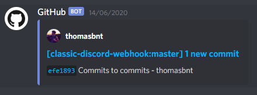
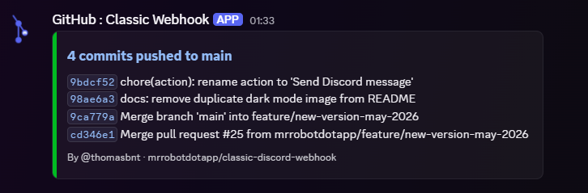

# Discord Commit Webhook

[](https://github.com/marketplace/actions/discord-commit-webhook) [](https://github.com/sponsors/thomasbnt) [](./LICENSE)


> A GitHub Action that sends a clean, structured Discord notification on every push — using Discord **Components v2**.

| Standard GitHub webhook | Discord Commit Webhook |
| :---------------------: | :---------------------: |
|  |  |

The default GitHub→Discord integration dumps raw commit messages into chat. This Action formats them into a structured message with clickable commit links, branch name, author, and a changelog capped at 8 entries.

---

## Quick start

```yml
# .github/workflows/discord-push.yml
name: Discord Webhook

on: [push]

jobs:
  notify:
    runs-on: ubuntu-latest
    steps:
      - uses: actions/checkout@v4
      - uses: mrrobotdotapp/classic-discord-webhook@main
        with:
          id: ${{ secrets.DISCORD_WEBHOOK_ID }}
          token: ${{ secrets.DISCORD_WEBHOOK_TOKEN }}
```

## Setup

### 1. Create a Discord webhook

In your Discord server: **Server Settings → Integrations → Webhooks → New Webhook → Copy URL**.

The URL looks like this:

```text
https://discord.com/api/webhooks/{ID}/{TOKEN}
```

### 2. Add secrets to your repository

Go to Settings → Security → Secrets and variables → Actions → New repository secret:

| Secret | Value |
| --- | --- |
| `DISCORD_WEBHOOK_ID` | The `{ID}` part of the webhook URL |
| `DISCORD_WEBHOOK_TOKEN` | The `{TOKEN}` part of the webhook URL |

### 3. Add the workflow

Create `.github/workflows/discord-push.yml` with the snippet from [Quick start](#quick-start) above.

> [!NOTE]
> Need more help? [See this post on DEV](https://dev.to/mrrobot/follow-your-repository-from-discord-52ge).

---

## Inputs

| Input | Required | Description |
| --- | --- | --- |
| `id` | **Yes** | Discord webhook ID — first part of the webhook URL |
| `token` | **Yes** | Discord webhook token — second part of the webhook URL |
| `threadId` | No | Send the message to a specific thread in the webhook's channel |

---

## Sponsors

[](https://github.com/sponsors/thomasbnt)

[](https://github.com/sponsors/thomasbnt) [](https://www.buymeacoffee.com/thomasbnt?via=thomasbnt)
